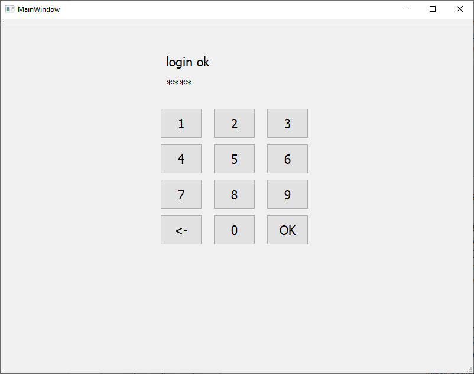
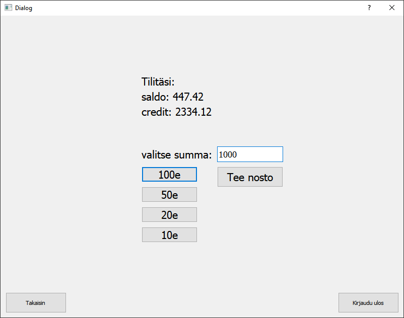
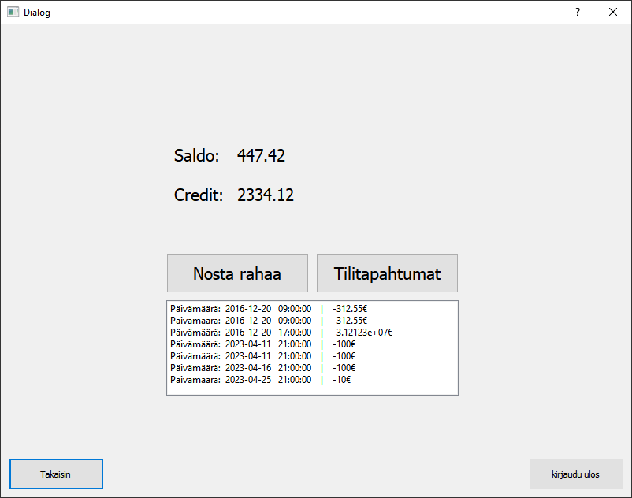

# BankSimul ATM

School project by Ville Niemi, Johannes Päivärinta, Jere Siermala, Janne Pauna, Niko Kokko

The ATM Simulator is a software application that enables users to withdraw money. The application is designed to simulate the functions of an ATM machine. The software has been developed using JavaScript to create a REST API, and Qt Creator to create the frontend. The data is stored in a MySQL database that has four tables: omistaja, kortti, tili, and tilitapahtumat.

# Features

The ATM Simulator offers the following features:

    Withdraw money
    Check account balance
    View transaction history
    User login/logout
    Serial port communication

 # Installation

To install the ATM Simulator, follow these steps:

Clone the repository:

git clone https://github.com/vilnie/BankSimul-ATM.git

    1. Install the required dependencies:

    MySQL server (Uni Server)
    Qt Creator (QSerial might not work every Qt version)
    IDE for backend code
    Postman/SQLworkbench
    Node.js

    2. Set up the MySQL database:

    Create a database named my_db
    
    Import the database schema from the dbdump.sql file
    
    3. Run the backend code with node.js

    4. Start the application:

    Run the frontend.exe file in Qt Creator

# Usage

To use the ATM Simulator, follow these steps:

    1. Insert your card into the card reader. You can bypass this by modifying frontend code.
    2. Enter your PIN code
    3. Select the bank account
    4. Select the desired transaction (e.g., withdraw money)
    5. Enter the transaction amount
    6. Wait for the transaction to complete
    7. Wait for automatic log out

# images

ER-Diagram

State Diagram

Application running

# Contributing

Contributions to the ATM Simulator are welcome. If you find a bug or have a feature request, please open an issue on the GitHub repository.

# License

The ATM Simulator is open-source software licensed under the MIT license. See the LICENSE file for more information.

